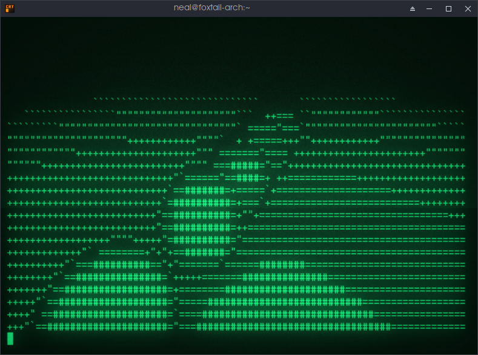
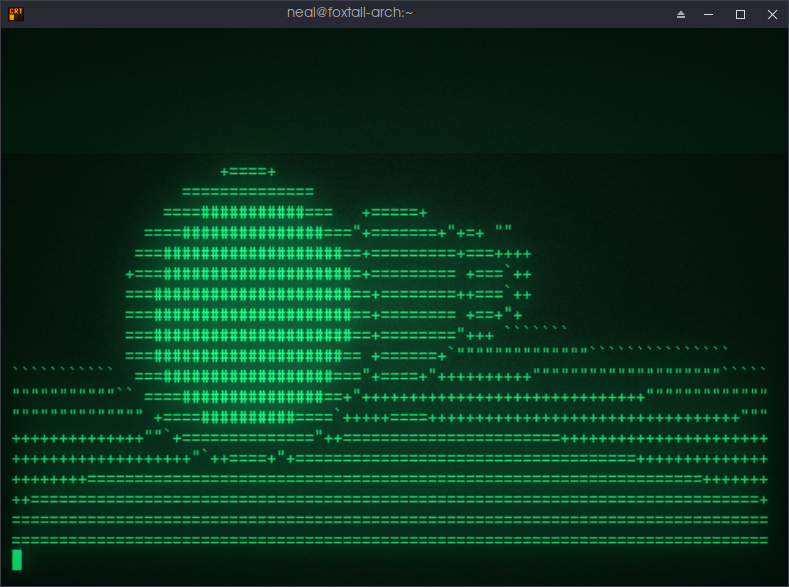

# RM-ASCII-Wren

Text mode Ray-marcher thrown together in a few hours, after getting bored in an introductory C programming class.

The code is full of comments, and is intended to be modified by whoever wants to look inside.





## Building

Not much to do with a single c file. Link with math library.

### GCC:

```
gcc main.c -lm -o ./rmasciiwren
```
